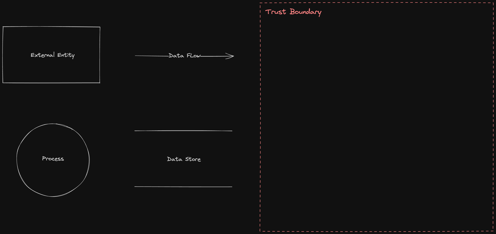

# Excalidraw Threat Modeling

An opinionated selection of shapes to turn the free and cross-platform Excalibur diagramming application into the perfect tool for threat modeling. This repo is a backup of the shapes, saved as a flat file. The official [Excalidraw Libraries](https://github.com/excalidraw/excalidraw-libraries) repository [will](https://github.com/excalidraw/excalidraw-libraries/pull/1009) host the library.

## Data Flow Diagrams
[Data Flow Diagramming](https://en.wikipedia.org/wiki/Data_flow_diagram) is a simple diagramming technique used to gain an understanding of how data flows in an application or system. DFDs are excellent for getting a bird's-eye view of a system to facilitate threat modeling.

This library intentionally uses just five items:
- **External entity**: Anything outside your control. Examples include people and systems run by other organizations or even divisions.
- **Process**: Any running code, including compiled, scripts, shell commands, SQL stored procedures, et cetera.
- **Data store**: Anywhere data is stored, including files, databases, shared memory, S3, cookies, et cetera.
- **Data flows**: All the ways that processes can talk to data stores or each other.
- **Trust boundary**: It should be a closed shape, usually a box. Clearly show what's inside in a way that OG arcs often fail to do.

## Shoutouts
This was inspired by the good old [Draw.io libraries for threat modeling](https://github.com/michenriksen/drawio-threatmodeling) by Michael Henriksen, with the goal to bring it in front of modern-age software engineers and **"be where they are"**, not enforcing them to use [insert your tool of choice], when they **want** and **use** Excalidraw.

You may also find Adam Shostack's [DFD3](https://github.com/adamshostack/DFD3) useful, but I'm not too fond of drums for data stores and don't care enough about space efficiency in a large diagram to drop circles in favor of rounded rectangles... 🤷🏼‍♂️

## Usage
- Open [excalidraw.com](https://excalidraw.com/) (or [install locally](https://docs.excalidraw.com/docs/@excalidraw/excalidraw/installation)), click the *Library* button, and then click *Browse Libraries*;
- Search for `Threat Modeling`;
- Start diagramming!
